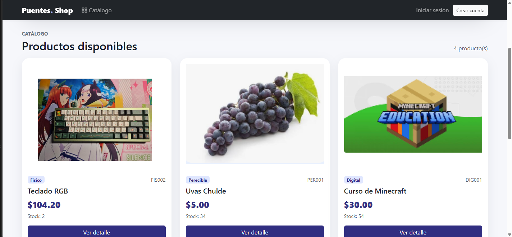
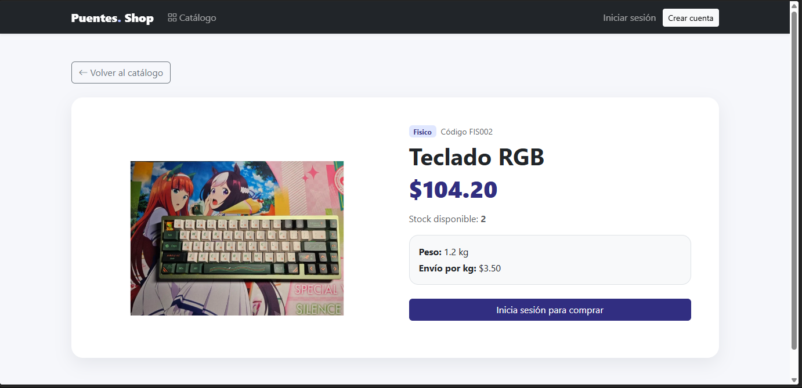
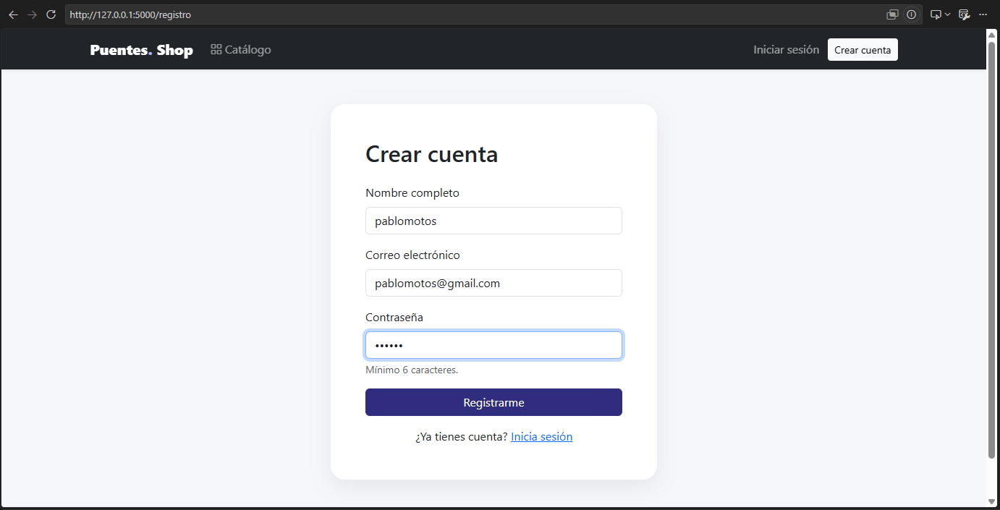
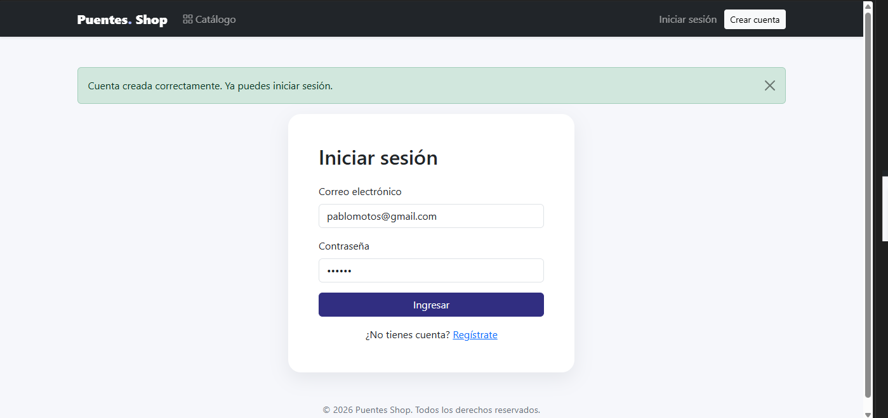

# Puentes Shop

Proyecto académico de una tienda online desarrollada con **Flask, PostgreSQL, SQLAlchemy y Bootstrap**.

## Funcionalidades

- POO con herencia y polimorfismo.
- CRUD de productos.
- Registro, inicio y cierre de sesión.
- Contraseñas encriptadas.
- Roles `cliente` y `admin`.
- Rutas protegidas.
- Carrito de compras.
- Subida de imágenes de productos.
- Mensajes `flash()` y diseño responsive con Bootstrap.

## Instalación

```powershell
python -m venv venv
.\venv\Scripts\Activate.ps1
python -m pip install -r requirements.txt
```

Copia `.env.example` como `.env` y configura PostgreSQL.

```env
DB_USER=postgres
DB_PASSWORD=TU_PASSWORD
DB_HOST=localhost
DB_PORT=5432
DB_NAME=tienda_online
SECRET_KEY=TU_CLAVE_SECRETA
```

Luego ejecuta:

```powershell
python init_db.py
python crear_admin.py
python app.py
```

Abrir en:

```text
http://127.0.0.1:5000
```

## Evidencias

### Catálogo de productos



### Detalle de producto



### Crear cuenta



### Inicio de sesión



## Seguridad

El archivo `.env` contiene las credenciales locales y está excluido del repositorio mediante `.gitignore`.
